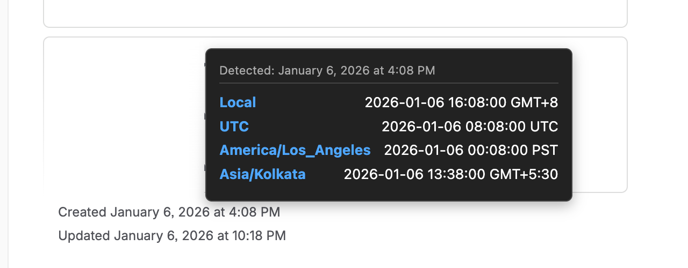
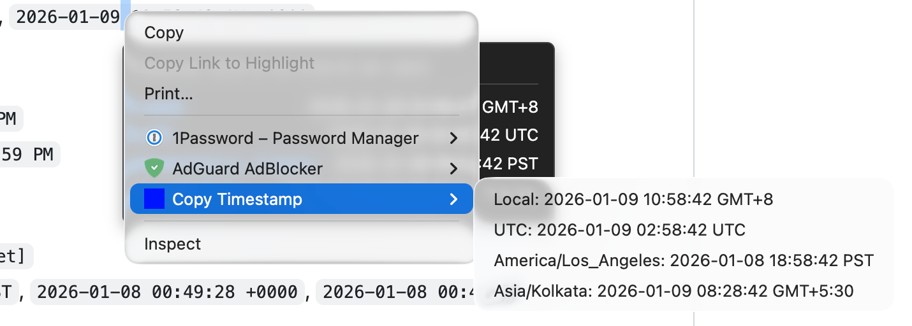
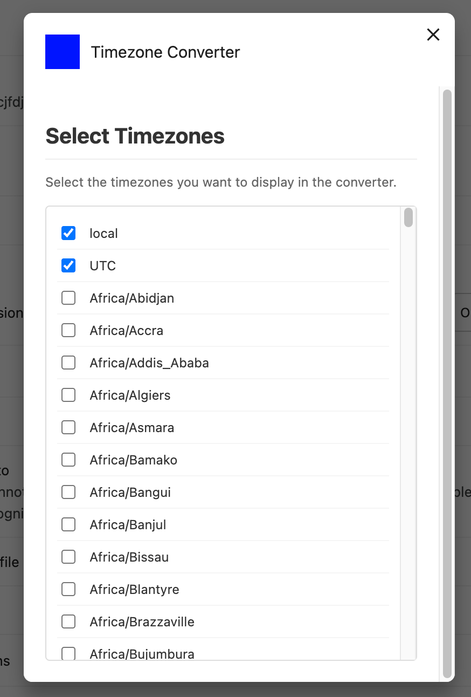

# Chrome Plugin Time Converter

A Chrome extension that automatically converts timestamps and dates on web pages into a readable format.

## Features

- **Automatic Conversion**: Detects and converts timestamps (Unix, ISO 8601, etc.) on web pages.
- **Copy to Clipboard**: Right-click on any recognized timestamp to copy its converted value to your clipboard.
- **Configurable**: Options to customize the output format (if applicable).
- **Lightweight**: Minimal impact on page performance.

## Supported Formats

The extension detects and converts the following date/time formats on hover:

1. **Standard Date Time (with AM/PM)**
   - `YYYY-MM-DD H:mm:ss AM/PM [Offset]`
   - Example: `2026-01-09 2:58:42 AM`, `2026-01-09 10:58:42 AM +0800`

2. **Verbose Format**
   - `MonthName DD, YYYY at H:mm AM/PM`
   - Example: `November 6, 2025 at 4:59 PM`

3. **User Specific / Log Format**
   - `YYYY-MM-DD HH:mm:ss [Zone/Offset]`
   - Example: `2026-01-08 00:49:28 PST`, `2026-01-08 00:49:28 +0000`, `2026-01-08 00:49:28`

4. **ISO-8601**
   - `YYYY-MM-DDTHH:mm:ss.sssZ` (with optional milliseconds and offset)
   - Example: `2026-01-08T00:49:28Z`, `2026-01-08T00:49:28.123+05:30`

5. **RFC 2822 / Email Format**
   - `Day, DD Mon YYYY HH:mm:ss Offset`
   - Example: `Thu, 08 Jan 2026 00:49:28 +0000`

6. **US Slash Format**
   - `MM/DD/YYYY HH:mm:ss`
   - Example: `01/08/2026 14:30`, `01/08/2026 02:30 PM`

7. **Short ISO**
   - `YYYY-MM-DD HH:mm`
   - Example: `2026-01-09 14:00`






## Installation

### 1. Build from Source

Prerequisites:
- [Node.js](https://nodejs.org/) (Latest LTS recommended)
- npm (comes with Node.js)

Clone the repository and install dependencies:

```bash
git clone <repository-url>
cd chrome-plugin-time-converter
npm install
```

Build the extension:

```bash
npm run build
```

This will generate the production-ready extension in the `dist/` directory.

### 2. Load into Google Chrome

1. Open Google Chrome and navigate to `chrome://extensions/`.
2. Enable **Developer mode** using the toggle switch in the top right corner.
3. Click the **Load unpacked** button in the top left.
4. Select the `dist/` directory from this project.

The extension should now be installed and active.

## Development

To work on the extension with live updates:

```bash
npm run watch
```

This will automatically rebuild the project whenever you make changes to files in the `src/` directory. After a rebuild, you may need to reload the extension in `chrome://extensions/` or refresh the web page you are testing on.

> [!WARNING]
> This application is built by AI agents using "vibe coding" techniques. Code structure and logic may be experimental or non-standard.

## Project Structure

- `src/`: Source code.
- `dist/`: Compiled/bundled extension (load this folder into Chrome).
- `webpack.config.js`: Build configuration.
